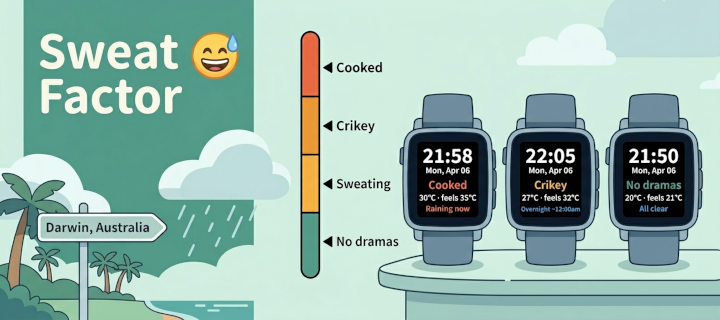
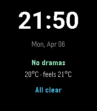
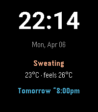
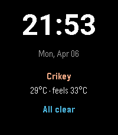
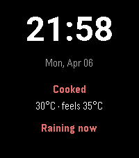
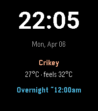

# Sweat Factor

A Pebble watchface for tropical climates. Where temperature is nearly meaningless. Dew point and rain timing are what you actually care about.

Built for the **Pebble Time 2 (emery)**, 200×228 colour display.

---

## Screenshots

| No dramas | Sweating | Crikey | Cooked | Overnight rain |
|-----------|----------|--------|--------|----------------|
|  |  |  |  |  |

---

## Features

- **Sweat Factor label** — derived from dew point, not temperature: No dramas / Sweating / Crikey / Cooked
- **Actual and feels-like temperature** — so you know how the air actually feels on your skin
- **Rain ETA** — scans the next 48 hours and tells you when rain is coming, with day-aware labels: tonight, overnight, tomorrow
- **Colour-coded at a glance** — Sweat Factor label changes colour by severity; rain line turns orange when it's close
- **Configurable labels** — don't want Aussie slang? Set your own names via the settings icon in the Pebble app
- **Live location** — uses your phone's GPS to fetch local Open-Meteo data, no hardcoded location
- **Offline fallback** — caches your last known coordinates so the watchface keeps updating if geolocation temporarily fails
- **Adaptive refresh** — fetches every 15 minutes normally, every 5 minutes when rain is within an hour

---

## Sweat Factor Scale

Derived from dew point (°C) — the number that actually measures how humid the air feels:

| Dew point | Default label | Colour |
|-----------|---------------|--------|
| Below 18° | No dramas | Teal |
| 18–21° | Sweating | Amber |
| 21–24° | Crikey | Amber |
| 24°+ | Cooked | Orange |

All four labels are customisable — tap the settings icon next to Sweat Factor in the Pebble app.

---

## Rain ETA

Scans the next 48 hours for precipitation probability above 50%:

| Display | Meaning |
|---------|---------|
| `All clear` | Nothing forecast in the next 48 hours |
| `Raining now` | Currently precipitating |
| `Rain in ~20min` | Rain likely within the hour |
| `Rain ~4:30pm` | Rain later today |
| `Tonight ~10pm` | Rain this evening (after 8pm) |
| `Overnight ~2am` | Rain in the early hours |
| `Tomorrow ~2pm` | Rain tomorrow |
| `Storm ~4:30pm` | Thunderstorm forecast |

The rain line is **cerulean blue** when more than 20 minutes away, **orange** when rain is within 20 minutes or raining now.

---

## Data Source

Weather data from [Open-Meteo](https://open-meteo.com/) — free, no API key required.

Params: `hourly=precipitation_probability,dew_point_2m,temperature_2m,apparent_temperature,weather_code` with `timezone=auto` so all times are local, never UTC.

---

## Colour Scheme

Black background. Sweat Factor label and rain ETA are colour-coded as above. Time is white; date is muted grey. No icons, no unnecessary chrome — just the numbers you need.

---

## Credits

App icon: [Twemoji](https://github.com/twitter/twemoji) 😅 by Twitter, licensed under [CC-BY 4.0](https://creativecommons.org/licenses/by/4.0/).
